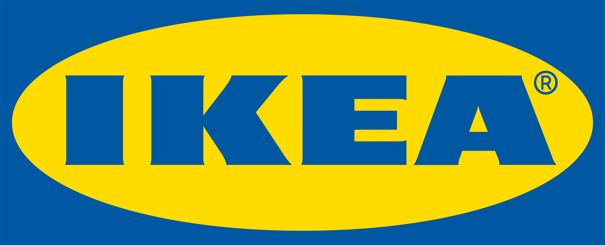
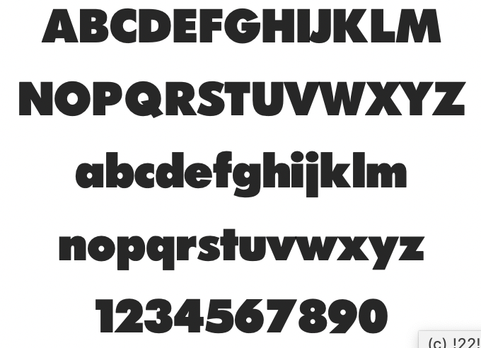
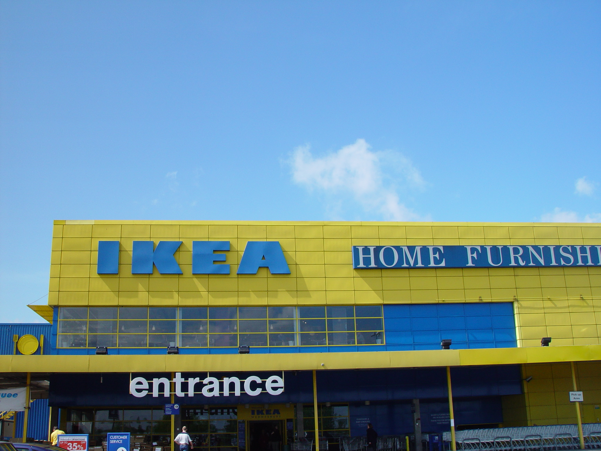
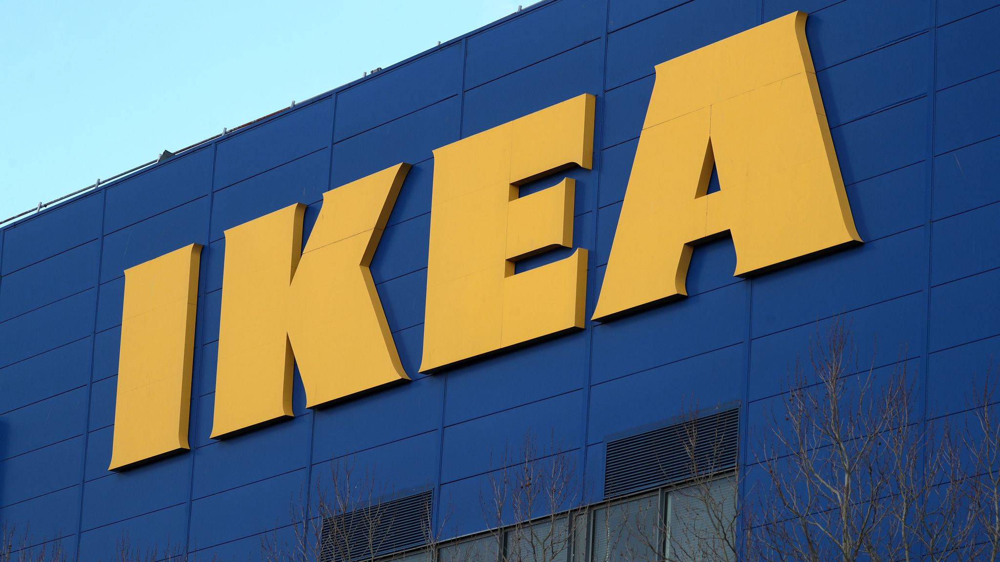

IKEA stores are all over the place - not just in Sweden but all over Europe. The brand is highly visible and recognisable because of its distinctive font and colour contrast. When it comes to big text, then the IKEA logo is highly visible at a distance. This is what counts, because the IKEA stores are usually located at the edge of towns and cities, near airports, or on 'out of town' shopping malls.

The IKEA stores are located near to motorways and are easily spotted even if you take the wrong exit!

The logo for IKEA has changed but only subtly. There was some redesign of the logo done by the[ Seventy Agency and 72andSunny Amsterdam](https://www.underconsideration.com/brandnew/archives/new_logo_for_ikea.php). Apart from some very slight size changes the serifs were reduced further.

Graphics website [Brand New](https://www.underconsideration.com/brandnew/archives/new_logo_for_ikea.php) has published a series of diagrams that show how simple the changes are.

Apparently, the result is intended to create a "bigger brand presence" within the same amount of media space.

The font used in the logo is not publicly available but you can see that it does have very subtle serifs built onto a Futura type font. The closest you might get would be 'FuturaPress' a free font from [FontsGeek](https://fontsgeek.com/fonts/FuturaPress-Press).

The image shown above was taken in 2003 and since then the IKEA brand has changed  - subtly. You can see here that back then there were no serifs at all and the font was a heavy version of 'Futura'. You may also notice that back then that the building was yellow and the logo was in blue. Now the store has changed colour (see below).

So, whatever you think of the IKEA logo and the flat-pack culture, you must admit that the way they display their name in **yellow** over a **blue** background, catches your attention as you zip by at 70mph!

Here is another image of an anonymous store, showing those little serifs.

