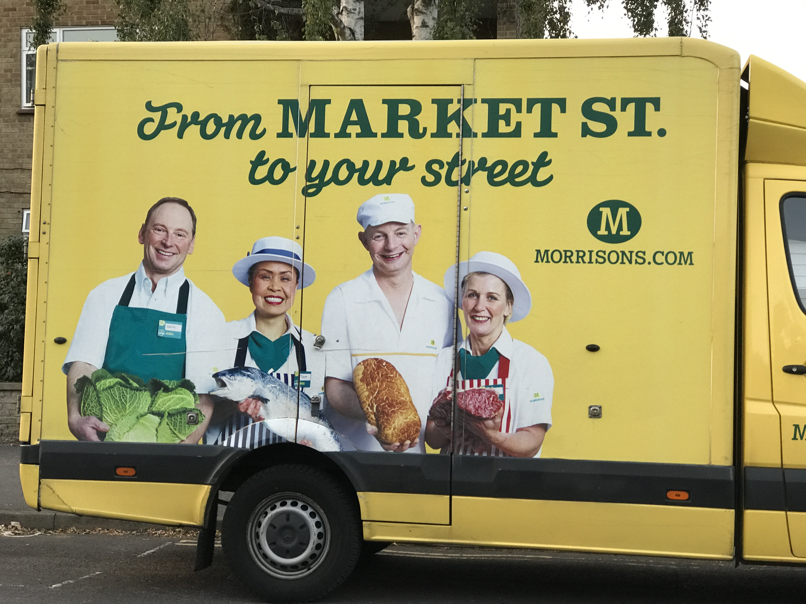

RedLorryYellowLorryRedLorryYellowLorryRedLorryYellowLorryRedLorryYellowLorry. Try saying that very quickly and see if your tongue gets all twisted up. Yes, this post is all about lorry (*trucks* if you are from the USA) typography.

Big lorries need big type. That's true but another thing that is also true is that companies use their own distribution transport to advertise themselves and a recent trend is to come up with a catchy slogan that goes beyond just the name of the company.

When it comes to making full use of the space, look no further than FedEx (notice the camelcase too).

The FedEX logo used a bold form of the Futura typeface although there is a bit of manipulation of the spacing to achieve the arrow formed between the **E** and **x**. I have highlighted this in the image below.

## Big Lorries provide a Lot of Space

Think of it as a moving billboard. The lorries we see on our motorways are often huge. We don't want those big polluting vehicles coming into our cities and so, the distribution centres are usually somewhere out on the ring road. But a big lorry canvas is a space for the large scale typography to reach you as it flashes by at 60mph.

## Less is More

On the one hand, you might want to fill the space and make the message easy to read at high speeds, but then if the lorry is smaller (like for making local deliveries), then you can afford to have a bit of detailed information, such as in this **ESSELUNGA** vehicle seen in Florence, Italy.

The Akceler typeface can be found for purchase from various foundries but freely available. You can see here the glyphs provided in the bold form.

## Parked Lorry - time to ponder

With local delivery lorries they are often parked up while the delivery takes place. In this case the decal designer has more scope to tell a story.

This Bidfest food delivery vehicle is being used as a canvas for a landscape collage created from food products. The typography itself (bottom left) is lost in the whole scene.

## Logo and Branding

We can't always identify the fonts used in a logo, because the lettering is significantly modified or, indeed built from geometry. Take this DHL logo which appears top left on this *huge* yellow delivery lorry.

The letters in the logo are created to indicate a sense of movement

I want to point out the [DHL web site that defines their brand](https://www.dpdhl-brands.com/dhl/en.html) and how all of the design elements (including the logo) are to be used across the company. This represents a fine example of a design scheme that unifies the brand.

DHL (and Deutsche Post) have created their own font called 'Delivery' and you can see this used all across their branding (including the byline on the lorry above). I quote from their branding guidelines:

> Delivery was developed exclusively for DHL, Deutsche Post and Deutsche Post DHL Group. It is available for anyone involved in the design of our marketing and communications materials. While it will be automatically installed on staff computers, it is also available for download and distribution to agencies and other service providers in the download section at the end of this guide.

I was amazed to find that you can download this font with full instructions. Thanks DHL.

## Red Lorry Yellow Lorry

Have you noticed how so many lorries are yellow?

The Red Lorry / Yellow Lorry expression is known as a tongue twister [^1]

[^1]:[ https://en.wikipedia.org/wiki/Tongue-twister](https://en.wikipedia.org/wiki/Tongue-twister)

