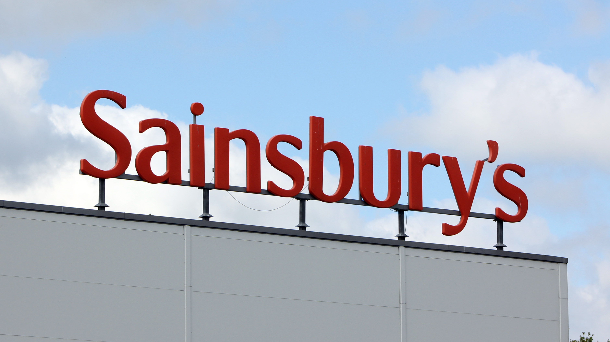

Sometimes we just need to put that text **in the sky**! Get the message visible across the city may mean building a structure and elevating the words as high as possible. We will need a good strong structure of course.

If your building isn't high enough, you'll need to create the letters in 3 dimensions and attach to a stable scaffold.

Tesco are fortunate, because they don't need to construct holding mechanisms for punctuation. Not so their arch rival, Sainsbury's. In the image below, you see some welded contraption to keep that apostrophe in place.

Check out the letter **i**, this also needs an appendage. Letters in the sky need a scaffold for support, and sometimes this can be quite elaborate.