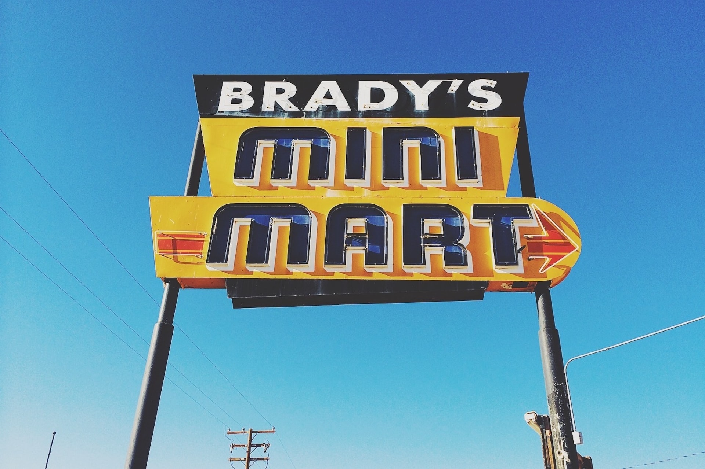
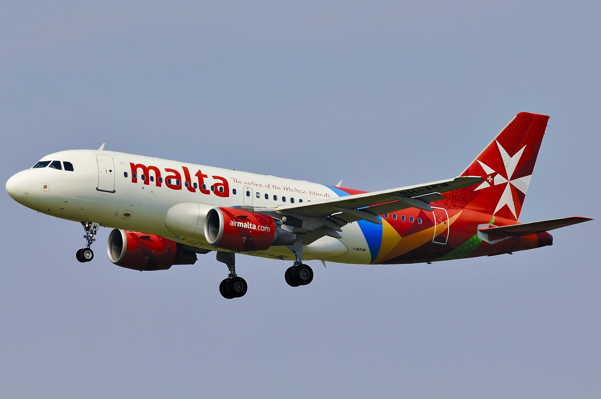
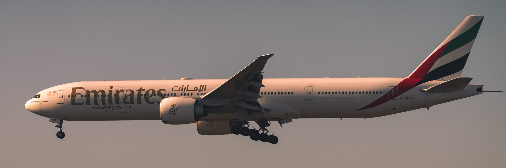
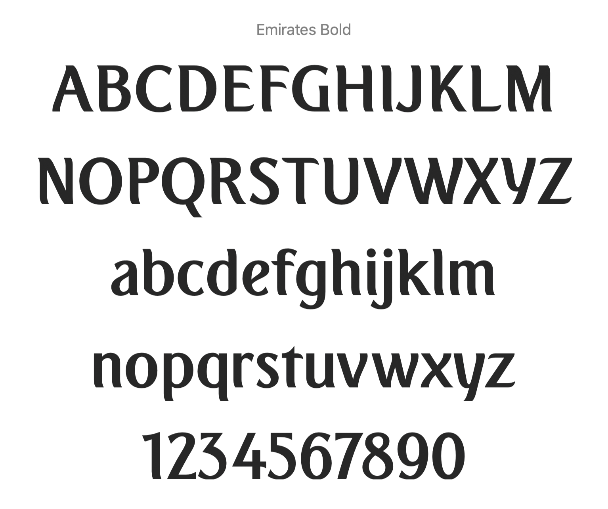

Sometimes we just need to put that text **in the sky**! Getting the message visible across the city may mean building a structure and elevating the words as high as possible. We will need a good strong structure of course.

If your building isn't high enough, you'll need to create the letters in 3 dimensions and attach to a stable scaffold.

Tesco are fortunate, because they don't need to construct holding mechanisms for punctuation. Not so their arch rival, Sainsbury's. In the image below, you see some welded contraption to keep that apostrophe in place.

Check out the letter **i**, this also needs an appendage. Letters in the sky need a scaffold for support, and sometimes this can be quite elaborate.

## Signs are UP in the USA

If you have ever been fortunate enough to visit the United States, you will notice that there are very many signs elevated on scaffolding; hotels, motels and stores advertise their presence with elaborate constructions.  These signs are sometimes to be found atop the building but also often separate structures have been built to hold the lettering.

Photo by [Joshua Lewis](https://unsplash.com/@joshuaaaronlewis?utm_source=unsplash&utm_medium=referral&utm_content=creditCopyText) on [Unsplash](https://unsplash.com/s/photos/motel-sign?utm_source=unsplash&utm_medium=referral&utm_content=creditCopyText)

I haven't been able to identify the typeface used in the *mini mart* words, however, one interesting observation is that this is a mixed case font; notice the uppercase `A` and the lowercase `n`.

## Type in Flight

The ultimate place to observe type in the sky is the graphic livery on aeroplanes in the clouds. Of course, the designs we see on the fuselage of these planes is dependant on the design schemes and branding of the companies that operate them. Here are some examples.

Photo by [Daniel Eledut](https://unsplash.com/@pixtolero2?utm_source=unsplash&utm_medium=referral&utm_content=creditCopyText) on [Unsplash](https://unsplash.com/s/photos/airplane-signage?utm_source=unsplash&utm_medium=referral&utm_content=creditCopyText)

The branding designed by FutureBrand uses a form of PT Sans Designed by ParaType. The name used a mixture of light and bold as in air**malta.**

Photo by [Fotis Christopoulos](https://unsplash.com/@digitaldev?utm_source=unsplash&utm_medium=referral&utm_content=creditCopyText) on [Unsplash](https://unsplash.com/s/photos/%22emirates-airplane%22?utm_source=unsplash&utm_medium=referral&utm_content=creditCopyText)

The Emirates brand uses a bespoke font designed for them by their own design team. The font was designed in 2003 and the bold form can be found for download in various places on the web.  The shape of the letters seems to be a subtle nod to Arabic letterforms with their elaborate curves.

Next time you make a journey by air, do take notice of the typefaces used.