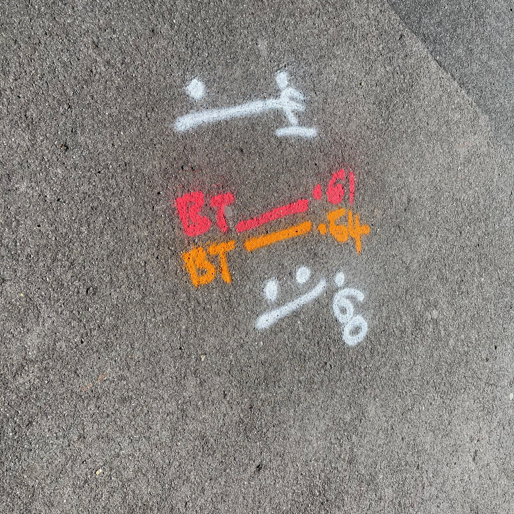

We must offer some admiration for those people who paint the text on the road. These letters (white or often yellow), are painted skilfully so as to read well from an angle. Of course, the letters need to be geometrically perfect, but some distortion helps the readablity from a moving vehicle.

## Typeface

Most often the type face used will be sans serif, but I have one example here where there is a slab serif used.

## Construction Lines

The letters don't last forever and so they do need repainting from time to time. When there is a new lettering project then chalk is used to outline the letters to guide the "painter". Using the term painter may be a misnommer since paint brushes are not involved!

## How do they do It?

For sure they cause a bit of traffic congestion while they mark the road, but as you can see from these videos, it takes a lot of skill to do this right. We only see the final stage of applying the "paint", but there must also be a few other stages before this; planning on paper and marking out with chalk on the ground.

<iframe width="560" height="315" src="https://www.youtube.com/embed/IC7VmzghjoI?rel=0" allow="accelerometer; autoplay; encrypted-media; gyroscope; picture-in-picture" allowfullscreen></iframe>

## Colour

As you can see from the following image (note the chalk marks), the letters can be yellow. BUS STOP has different colour from BUS LANE.

<iframe width="560" height="315" src="https://www.youtube.com/embed/9iesYp2BpZ4?rel=0" allow="accelerometer; autoplay; encrypted-media; gyroscope; picture-in-picture" allowfullscreen></iframe>

## Mystery Squiggles and Markings

You may occasionally see markings that are not using typeface styles but are just hand written markings.

