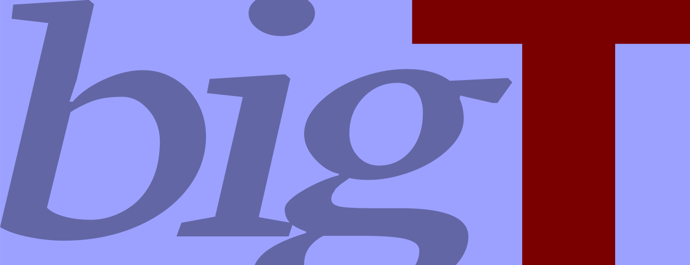

This site is all about large text; text that is meant to be read from a distance.

I am on the lookout for examples (good and bad) of the way text can be seen in the environment where the scale is often presented at sizes that might be described as big, large and gigantic.

What examples are we likely to find here:

* posters
* billboards
* buildings
* signage
* livery - transport / lorries / planes / ships

## My logo and banner image

I decided to create my logo and banner image from text and used the full space (the square in the logo and the wide) for the text. The 2 words *Big* and *Text* in contrasting colours - bright and dramatic.

I put the full logo here:

And here is the image from the banner in all its glory. I'll be using this on the cover of the book that will be published from 10 of my blog posts. Watch this space!

### The name of my site / project

I decided to name my site *BigText* using CamelCase; and if you don't know what that means just look at the way the word camelcase is displayed here.

### One more thing

The image in the banner for this about page is from a photograph taken in the printmaking department at Oxford Brookes University of letterpress wood type. The image shows uppercase, lowercase and numbers in the same drawer. This type would normally be used for printing posters, such as the one that finishes this page.

